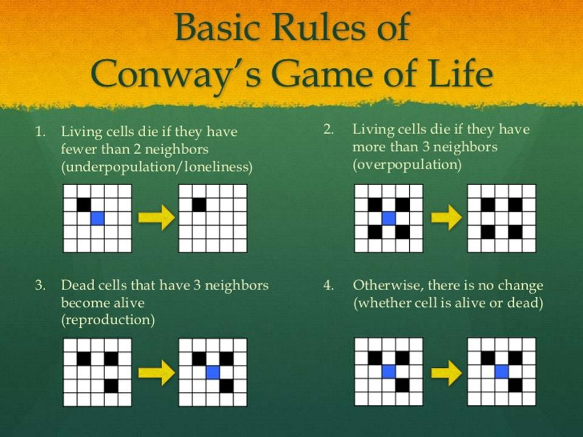

# game-of-life-javascript
- A application using vanilla JavaScript/ CSS/ and HTML 
- The Game of Life is a cellular automation devised by the British mathematician [John Horton Conway](https://en.wikipedia.org/wiki/John_Horton_Conway)

[Game of Life](https://www.youtube.com/watch?v=CgOcEZinQ2I&feature=youtu.be)

## Rules for Game of Life

